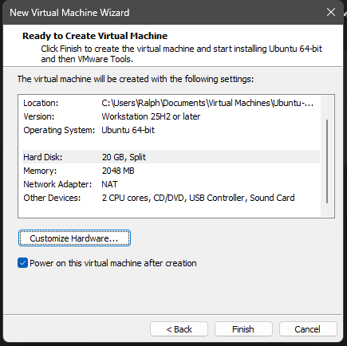
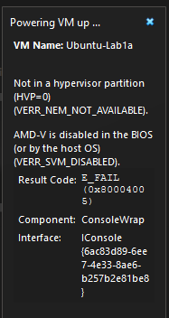
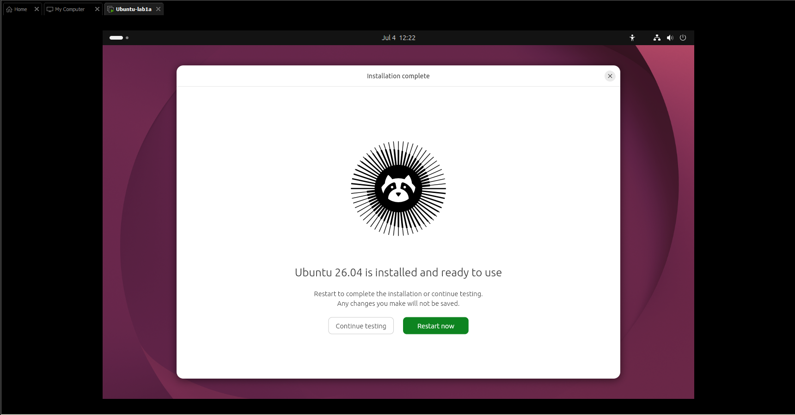
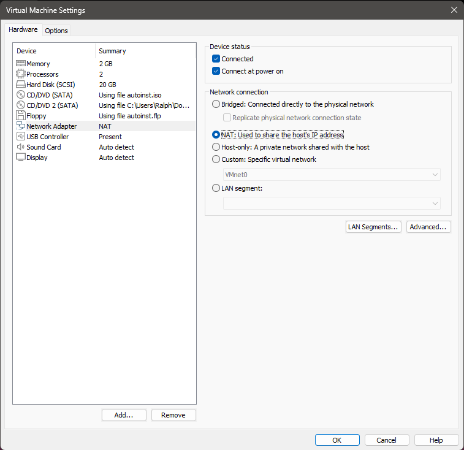
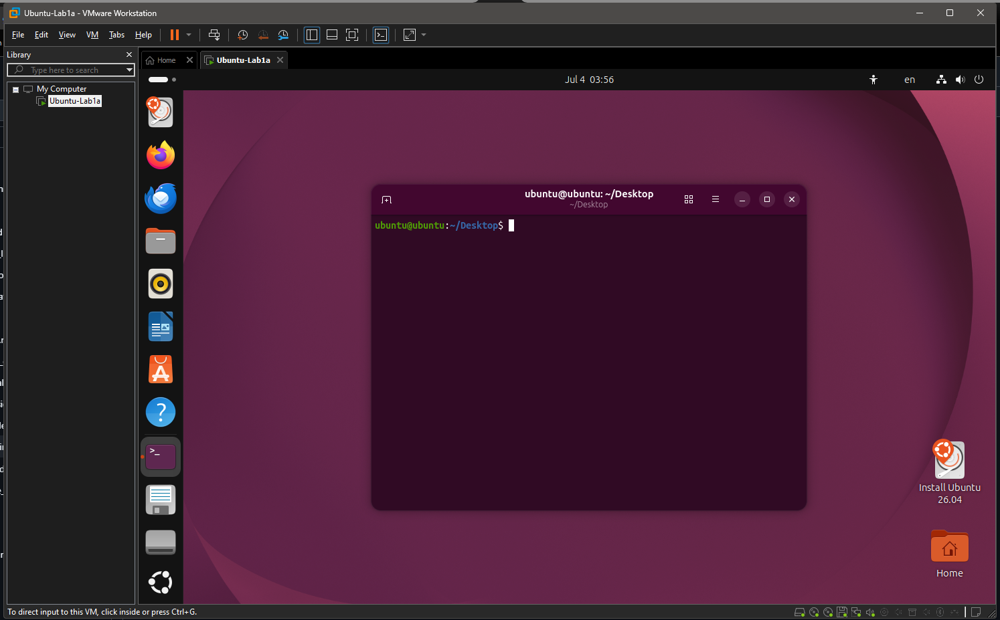
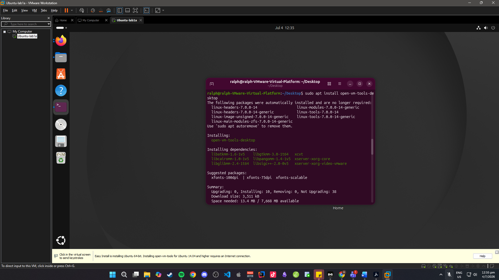
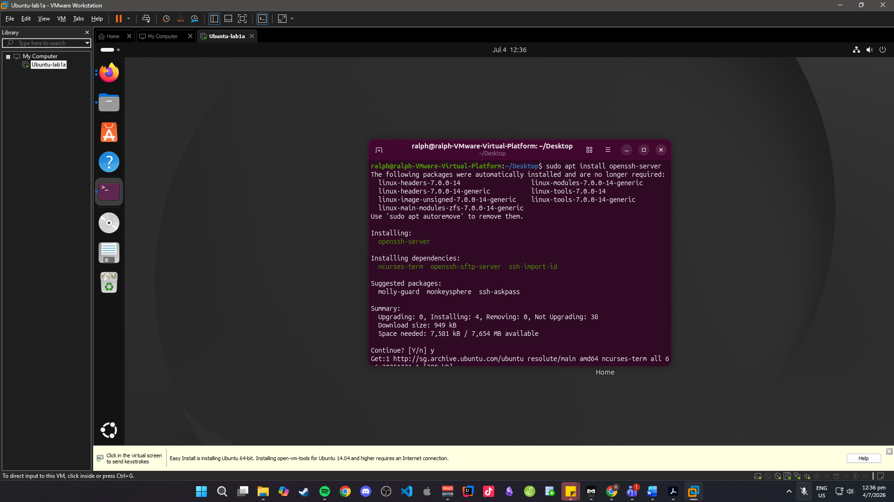

# Lab-1a Installing VMware and Ubuntu

1. Installed VMware on host OS (Windows 11). would show the VMware application installed and visible in the Start Menu.  

2. Downloaded Ubuntu 22.04.3 LTS ISO image from the official Ubuntu website. Screenshot would show the downloaded file (ubuntu-22.04.3-desktop-amd64.iso).  

3. Created a new Virtual Machine in VMware named 'Ubuntu-Lab1a' with 2048 MB RAM and 20 GB disk. Screenshot would show VM settings (RAM, boot order, ISO mounted).   

4. Booted VM using ISO and installed Ubuntu. Screenshot would show successful login screen of Ubuntu desktop.
- Encountered an error where I had to enable SVM in BIOS as the Virtual Machine gave me this error

5. Configured network settings in VMware using NAT mode. Screenshot would show VMware Network settings page with NAT selected, 

 

6. Verified Ubuntu running with GUI access. Screenshot would show Ubuntu desktop with Terminal open.

7. Installed VMware tools inside Ubuntu. Evidence would include successful execution of `sudo apt install open-vm-tools-desktop -y` and reboot.  

8. Enabled SSH server (advanced option). Screenshot would show `sudo apt install openssh-server` and `systemctl status ssh` confirming active service.  

